###########################################
Estimate the Sensitivity of your Instrument
###########################################
|TestStatus| |PyPiStatus| |BlackStyle| 

Made for astronomy with gamma-rays in the atmospheric Cherenkov-method to compute the integral or differential sensitivity of your instrument with respect to the gamma-rays energy.

Key features:

- Estimates differential sensitivity

- Estimates integral sensitivity

- Propagates uncertainties for all quantities, everywhere

Related to:

- https://github.com/cherenkov-plenoscope/lima1983analysis

- https://github.com/cherenkov-plenoscope/spectral_energy_distribution_units

*******
Install
*******

.. code-block::

    pip install flux_sensitivity_sebastian-achim-mueller

************************
Differential Sensitivity
************************
For demonstration, we show how to compute the differential sensitivity for the Cherenkov-Telescope-Array (CTA) based on a public estimate for its response-function [``Prod5-South-20deg-AverageAz-14MSTs37SSTs.1800s-v0.1.fits``].
From the response-function we need the following three estimates:

Instrument Response Function
============================
To be precise: This response-function is what I (as a non CTA-member) extracted from the provided documentation. To extract these quantities I interpolate and/or average over e.g. solid angle. The script ``flux_sensitivity/scripts/read_irf_and_estimate_differential_sensitivity.py`` reads CTA's instrument-response and writes the differential sensitivity for the various scenarios.

We use ``e`` for true gamma-ray-energy and ``e'`` for reconstructed gamma-ray-energy.

Rate of background ``R[e']``
    |img_irf_background_rate_onregion|
    
    The rate of background (the sum of all contributions) w.r.t. to reconstructed gamma-ray-energy.

Area for signal ``A[e]``
    |img_irf_signal_area|

    The effective area to collect gamma-rays w.r.t. the true gamma-ray-energy.

Probability to confuse energy ``M_\gamma[e, e']``
    |img_irf_probability_reco_given_true|

    The probabilty to confuse the true with the reconstructed gamma-ray-energy.
    This is also called energy-migration.

Scenarios
=========

This package offeres multiple scenarios how to handle the instrument's non perfec reconstruction in energy.
Each scenario results in a different estimate for the instrument's differential sensitivity.
The scenarios are named using colors to point out their differences while not implying a hierachy.
We compiled this list of scenarios from what we found in the wild.
We do not think that any of the shown scenarios is superior, we just want to raise awareness.

The figure below shows the settle differences of the scenarios.

+-----------------------+-----------------------+-----------------------+-----------------------+
| blue                  | yellow                | green                 | black                 |
+=======================+=======================+=======================+=======================+
| |img_diff_sens_blue|  | |img_diff_sens_yellow|| |img_diff_sens_green| | |img_diff_sens_black| |
+-----------------------+-----------------------+-----------------------+-----------------------+
| The differential sensitivity computed by this package is in black.                            |
| The differential sensitivity provided by CTA is in blue                                       |
| (The blue bars are canted because CTA only provides these when multiplying the                |
| flux-axis with the energy to some power).                                                     |
| For reference, the differential sensitivity of Fermi-LAT (10 years) is shown in orange,       |   
| and the flux of the Crab-nebula (``1e0``, ``1e-1``, ``1e-2``, ``1e-3``) is in dashed lines.   |
+-----------------------------------------------------------------------------------------------+

Fortunately, we found a way to represent each scenario by using the two matrices ``G`` and ``B``.
Matrix ``G`` defines how a scenario takes the effective area for the signal into account

.. math::

   A^k[e'] &=& \sum_{e} G^k[e, e'] A[e],

and matrix ``B`` defines how a scenario takes the rate of background into account

.. math::

   R^k[e'] &=& \sum_{e} B^k[e, e'] R[e].

Here ``A^k[e']`` is the area of the signal and ``R^k[e']`` is the rate of background used in scenario ``k``.

Blue
----
The ``blue`` scenario handles the instrument's non perfect reconstruction in energy by simply ignoring it.
Thus its matrix ``G`` is the unit-matrix.
As a result, the blue scenario's area for the signal is the area for the signal estimated in the instrument's response-function.
As matrix ``G`` does not mix true and reconstructed energy, the blue scenario shows the true gamma-ray-energy, what is good.
The matrix ``B`` is also the unit-matrix so that this scenario's rate of background is the estimated rate in the instrument's response-function.
But of course the blue scenario falls short when the instrumen's confusion in energy is significant.

+-------------------------------------+--------------------------------------------+
| Matrix ``G``                        | Matrix ``B``                               |
+=====================================+============================================+
| |img_G_matrix_in_scenario_blue|     | |img_B_matrix_in_scenario_blue|            |
+-------------------------------------+--------------------------------------------+
| Elements on diagonal are ``1.0``.   |                                            |
+-------------------------------------+--------------------------------------------+

+-------------------------------------+--------------------------------------------+
| Area for signal ``A^k[e]``          | Rate of background ``R^k[e']``             |
+=====================================+============================================+
| |img_signal_area_in_scenario_blue|  | |img_background_rate_in_scenario_blue|     |
+-------------------------------------+--------------------------------------------+

|img_diff_sens_blue|

+-------------------------------------+--------------------------------------------+
| pro                                 | contra                                     |
+=====================================+============================================+
| - Shows true energy                 | - Can not handle energy-confusion          |
+-------------------------------------+--------------------------------------------+

Yellow
------
The ``yellow`` scenario not only takes the signal in the energy-bin under investigation into account,
but also other bins in reconstructed gamma-ray-energy where the true gamma-ray-energy was confused to.
This is done by setting the matrix ``G`` to be the confusion of the instrument.
Thus in the yellow scenario the area of the signal can exceed the area estimated in the instrument's response function.
Unfortunately, the yellow scenario's matrix ``G`` has non zero elements off its diagonal what makes the
interpretation of this scenario's energy-axis difficult.
It is no longer only true gamma-ray-energy.

+-------------------------------------+--------------------------------------------+
| Matrix ``G``                        | Matrix ``B``                               |
+=====================================+============================================+
| |img_G_matrix_in_scenario_yellow|   | |img_B_matrix_in_scenario_yellow|          |
+-------------------------------------+--------------------------------------------+

+-------------------------------------+--------------------------------------------+
| Area for signal ``A^k[e]``          | Rate of background ``R^k[e']``             |
+=====================================+============================================+
| |img_signal_area_in_scenario_yellow|||img_background_rate_in_scenario_yellow|    |
+-------------------------------------+--------------------------------------------+

|img_diff_sens_yellow|

+---------------------------------------+--------------------------------------------+
| pro                                   | contra                                     |
+=======================================+============================================+
| - Takes energy-confusion into account | - Can not show true energy                 |
+---------------------------------------+--------------------------------------------+

Green
-----
The ``green`` scenario sets its matrix ``G`` to only the diagonal of the instrument's 
confusion.
With only having zeros off its diagonal, the matrix ``G`` allows the green scenario to 
show true gamma-ray-energy.
However, the green scenario is rather conservative in most astronomical applications
as it represents the sensitivity to detect a source which only emits gamma-rays in a
narrow range of energies and further ignores all the signal which was confused to
different energies.

+-------------------------------------+--------------------------------------------+
| Matrix ``G``                        | Matrix ``B``                               |
+=====================================+============================================+
| |img_G_matrix_in_scenario_green|    | |img_B_matrix_in_scenario_green|           |
+-------------------------------------+--------------------------------------------+
| Diagonal from energy-confusion.     |                                            |
+-------------------------------------+--------------------------------------------+

+-------------------------------------+--------------------------------------------+
| Area for signal ``A^k[e]``          | Rate of background ``R^k[e']``             |
+=====================================+============================================+
| |img_signal_area_in_scenario_green| | |img_background_rate_in_scenario_green|    |
+-------------------------------------+--------------------------------------------+

|img_diff_sens_green|

+---------------------------------------+-------------------------------------------------------+
| pro                                   | contra                                                |
+=======================================+=======================================================+
| - Shows true energy                   | - Ignores area of signal which was confused in energy |
| - Takes into account that confusion   |                                                       |
|   can reduce the area of the signal   |                                                       |
+---------------------------------------+-------------------------------------------------------+

Black
-----
The ``black`` scenario was proposed by Werner Hofmann and takes a different approach.
Instead of altering the area of the signal, this scenario alters the rate of the background.
The black scenario widens the energy-range in the background to the range required to collect one sigma (68%) of the signal.
This means that matrix ``B`` now collects contributions from multiple bins in reconstructed gamma-ray-energy.
The wider range in energy is estimated using the instruments confusion in energy by estimating the range in reconstructed gamma-ray-energy which contains 68% of the signal.
To represent the containment of 68% in the signal, this scenario's matrix ``G`` has the elements on its diagonal set to ``0.68``.
Matrix ``G`` has only zeros off its diagonal and thus the black scenario can show the true gamma-rays-energy on its energy-axis. 

+-------------------------------------+--------------------------------------------------------------------------+
| Matrix ``G``                        | Matrix ``B``                                                             |
+=====================================+==========================================================================+
| |img_G_matrix_in_scenario_black|    | |img_B_matrix_in_scenario_black|                                         |
+-------------------------------------+--------------------------------------------------------------------------+
| Elements on diagonal are ``0.68``.  | At low energies, the range in energy is wider to collect enough signal.  |
+-------------------------------------+--------------------------------------------------------------------------+

+-------------------------------------+--------------------------------------------+
| Area for signal ``A^k[e]``          | Rate of background ``R^k[e']``             |
+=====================================+============================================+
| |img_signal_area_in_scenario_black| | |img_background_rate_in_scenario_black|    |
+-------------------------------------+--------------------------------------------+

|img_diff_sens_black|

+---------------------------------------+-------------------------------------------------------+
| pro                                   | contra                                                |
+=======================================+=======================================================+
| - Shows true energy                   |                                                       |
| - Indirectly takes all                |                                                       |
|   energy-confusion into account       |                                                       |
+---------------------------------------+-------------------------------------------------------+

Algorithm ``C`` to Estimate the Critical Number of Signal-Counts ``N_S``
========================================================================
Independent of the different scenarios, there are additional degrees of freedom when computing a differential sensitivity.
One additional source of differences is: The algorithm ``C`` to compute the critical rate which is required in order to claim a detection.
After one has estimated the number of background-counts in the on-region ``\hat{N}_B``, one uses algorithm ``C`` to estimate the minimal number of signal-counts in the on-region

.. math::
    N_S[e'] &=& C(\hat{N}_B[e'], S, \dots)

which is required to claim a detection.
A possible input to ``C`` might be:

- The number of background-counts in the on-region ``\hat{N}_B``.

- The minimal significance ``S`` a signal has to have in order to be considered unlikely to be a fluctuation in the background.
  ``S`` is commonly chosen to be ``5\sigma``, (std.\,dev.).

- A method to estimate ``S`` based on the counts in the on- and off-regions.
  Here commonly Equation\,17 in \cite{li1983analysis} is used.

- An estimate for the systematic uncertainties of the instrument. This commonly demands ``N_S / \hat{N}_B > \approx 5\%``.
  When our instrument runs into this limit, more observation-time ``T_\text{obs}`` will no longer decrease the required flux to claim a detection.
    
- A limit on the minimal amount of statistics. This is commonly used to make sure that the estimator for ``S`` operates in a valid range of inputs.
  This might require the counts in the on- and off-regions to be above a minimal threshold e.g. ``N_\text{on} > 10``.

.. |BlackStyle| image:: https://img.shields.io/badge/code%20style-black-000000.svg
    :target: https://github.com/psf/black

.. |TestStatus| image:: https://github.com/cherenkov-plenoscope/flux_sensitivity/actions/workflows/test.yml/badge.svg?branch=main
   :target: https://github.com/cherenkov-plenoscope/flux_sensitivity/actions/workflows/test.yml

.. |PyPiStatus| image:: https://img.shields.io/pypi/v/flux-sensitivity-sebastian-achim-mueller
   :target: https://pypi.org/project/flux-sensitivity-sebastian-achim-mueller/

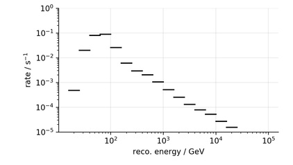

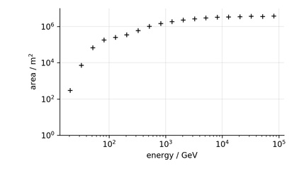

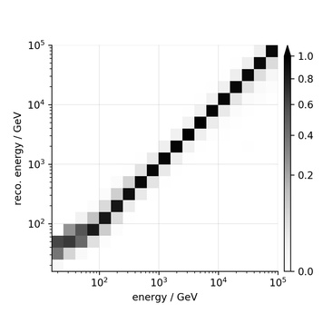

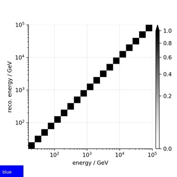

.. |img_G_matrix_in_scenario_yellow| image:: flux_sensitivity/tests/resources/cta/plot/G_matrix_in_scenario_yellow.jpg

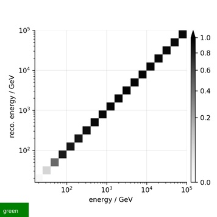

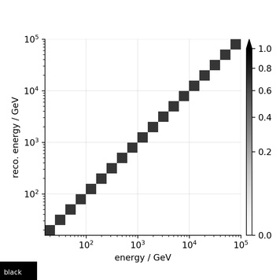

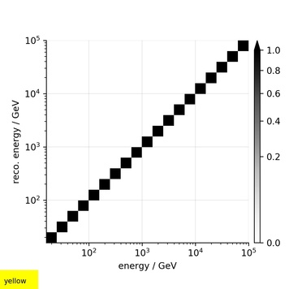

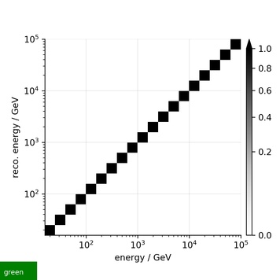

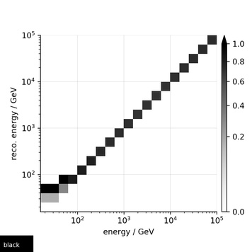

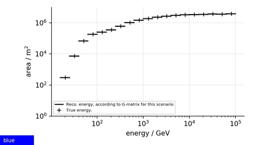

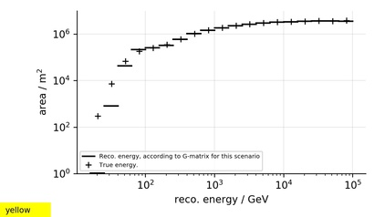

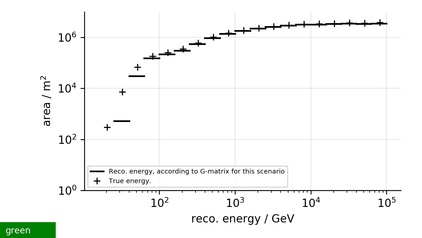

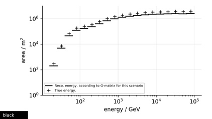

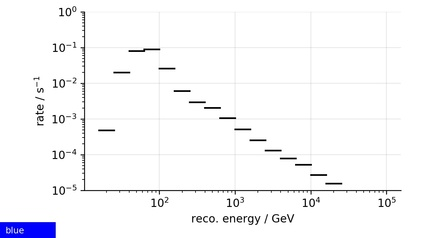

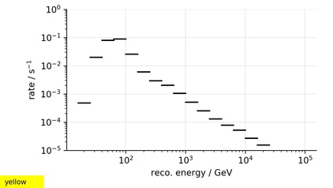

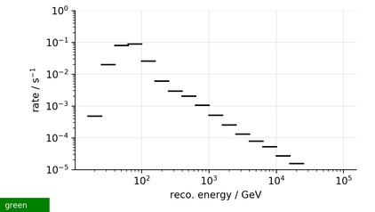

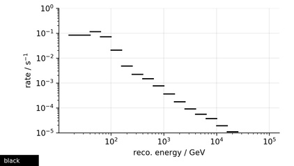

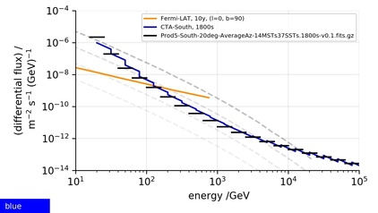

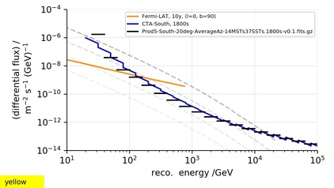

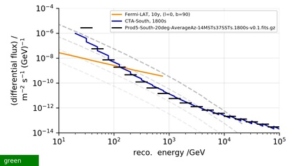

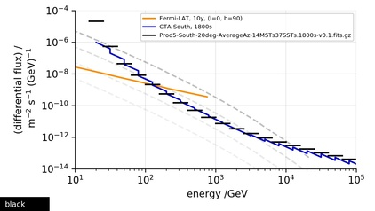
